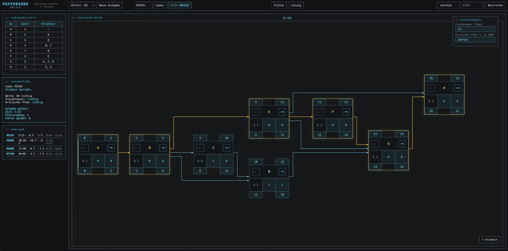

# PUFFERZONE

**Netzplan-Trainer für die IHK-Prüfungsvorbereitung, für alle IT-Ausbildungsberufe**

Eine einzelne HTML-Datei. Kein Build, kein Server, keine Installation. Öffnen, üben, fertig.

*Klick auf das Bild öffnet die volle Auflösung.*

PUFFERZONE generiert Netzplan-Aufgaben (Vorgangsknotennetze mit Vorwärts- und Rückwärtsrechnung, Puffern und kritischem Pfad), die du direkt im Browser löst: Knoten platzieren, Verbindungen ziehen, Werte eintragen, prüfen lassen. Netzplantechnik ist Stoff der AP1, und die ist berufsübergreifend identisch: Fachinformatiker aller Fachrichtungen (Anwendungsentwicklung, Systemintegration, Daten- und Prozessanalyse, Digitale Vernetzung) ebenso wie Kaufleute für IT-System-Management und Digitalisierungsmanagement schreiben dieselbe Prüfung. Die Knoten entsprechen dem in der IHK-Prüfung üblichen Format (FAZ/FEZ oben, Nr und Bezeichnung, Dauer/GP/FP, SAZ/SEZ unten).

[Zur Anwendung](https://lokthok.github.io/pufferzone/pufferzone.html)

## Features

**Aufgabengenerator mit Seeds.** Jede Aufgabe hat einen 5-stelligen Code (z. B. `M7KQF`). Erster Buchstabe = Schwierigkeit (L/M/S mit 6/8/10 Vorgängen), gleicher Code erzeugt auf jedem Gerät exakt dieselbe Aufgabe. Codes lassen sich per Zuruf teilen und funktionieren komplett offline.

**Interaktive Zeichenfläche.** Knoten per Klick platzieren, am Raster einrastend verschieben, mit orthogonalen Pfeilen verbinden (raus rechts, rein links). Knoten aus der Fläche ziehen entfernt sie wieder. Startknoten sind markiert.

**Prüfung mit Detail-Feedback.** Struktur (fehlende und überflüssige Verbindungen einzeln benannt) und alle Werte werden getrennt bewertet. Falsche Felder orange, leere Felder orange gestrichelt, korrekte cyan. Timer, Versuchszähler und Fehlerstatistik laufen mit, gelöste Aufgaben landen im lokalen Verlauf und lassen sich per Klick wiederholen.

**Multiplayer.** Raumname eingeben, beitreten, fertig. Wer eine Aufgabe offen hat, gibt sie an Neuankömmlinge weiter, neue Aufgaben wechseln für den ganzen Raum. Live-Highscore mit Versuchen, Fehlern, Zeiten und Siegzähler pro Match. Der Verbindungsaufbau läuft über öffentliche Nostr-Relays (Trystero/WebRTC), die Nutzdaten fließen danach direkt zwischen den Browsern.

**Cheatsheet.** Alle Formeln (FAZ, FEZ, SAZ, SEZ, GP, FP, Projektdauer, kritischer Pfad) samt Merkregel per Button auf der Arbeitsfläche einblendbar.

## Nutzung

1. `pufferzone.html` herunterladen und im Browser öffnen. Das ist alles.
2. Schwierigkeit wählen, **Neue Aufgabe** klicken oder einen Seed-Code laden.
3. Für Multiplayer brauchen alle Teilnehmer **dieselbe Dateiversion** und Internetzugang für den Verbindungsaufbau. Die Statuszeile zeigt den Relay-Zustand (z. B. `Relays 3/5`). Steht dort `0/x`, blockiert das Netzwerk ausgehende WebSocket-Verbindungen.
4. Falls der Multiplayer im `file://`-Kontext zickt: im Dateiordner `python3 -m http.server` starten und über `http://localhost:8000/pufferzone.html` öffnen.

Verlauf und Namenseinstellung liegen im localStorage des Browsers und verlassen das Gerät nicht.

## Formeln (Kurzfassung)

| Wert | Berechnung |
|---|---|
| FAZ | größtes FEZ aller Vorgänger, Startknoten: 0 |
| FEZ | FAZ + Dauer |
| SEZ | kleinstes SAZ aller Nachfolger, Endknoten: Projektdauer |
| SAZ | SEZ − Dauer |
| GP | SAZ − FAZ |
| FP | kleinstes FAZ der Nachfolger − FEZ, Endknoten: GP |

Merkregel: vorwärts MAXIMUM, rückwärts MINIMUM. Kritischer Pfad: durchgehende Kette mit GP = 0.

## Versionen

Aktuelle Version: **1.1.1**. Details siehe [CHANGELOG.md](CHANGELOG.md). Releases werden als Git-Tags geführt, versionierte Einzeldateien liegen bei den GitHub Releases.

## Lizenz

© 2026 [lokthok](https://github.com/lokthok)

Lizenziert unter der [GNU Affero General Public License v3.0](LICENSE) (AGPL-3.0). Nutzung, Weitergabe und Veränderung sind frei, auch kommerziell. Wer eine veränderte Version weitergibt oder als Dienst betreibt, muss den Quellcode unter derselben Lizenz offenlegen.
